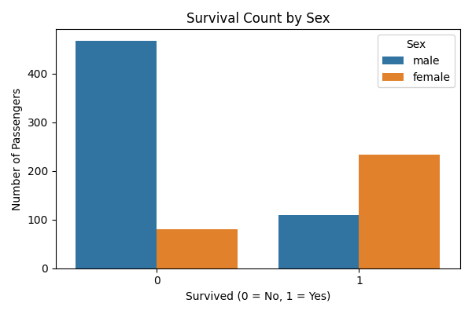
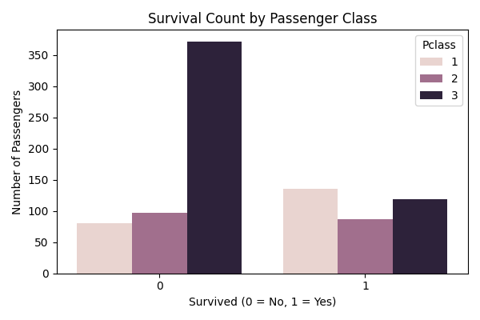
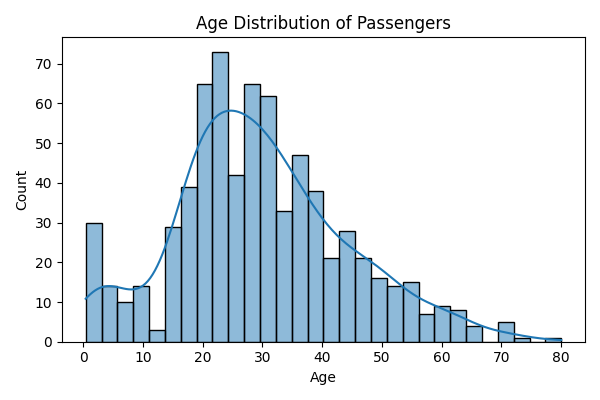
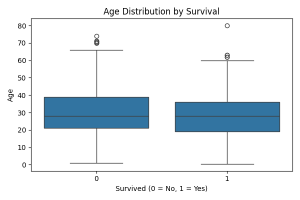
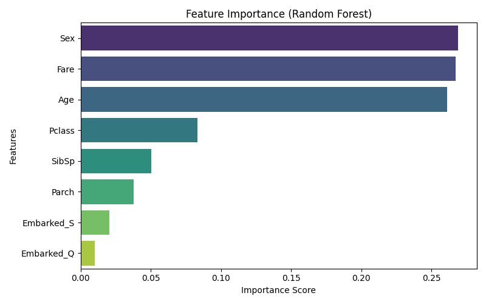

# Titanic Survival Prediction (Machine Learning Project)

## Project Overview

This project analyses the Titanic dataset and builds machine learning models to predict passenger survival based on demographic and socio-economic features.

It follows a complete data science workflow: Exploratory Data Analysis, feature engineering, modelling, and evaluation.

## Dataset

The dataset contains information about Titanic passengers, including:

- Age
- Sex
- Passenger class (Pclass)
- Fare
- Family relations (SibSp, Parch)
- Embarkation port

## Workflow

### 1. Exploratory Data Analysis (EDA)

- Analysed survival rates by sex, class, and age
- Identified key patterns affecting survival
- Handled missing values

### 2. Feature Engineering

- Encoded categorical variables
- Handled missing values
- Created model-ready dataset

### 3. Modeling

- Logistic Regression
- Random Forest Classifier

### 4. Evaluation

- Confusion matrix
- Precision / Recall / F1-score
- Cross-validation (5-fold)

## Model Performance

- Logistic Regression CV Accuracy: 0.79
- Random Forest CV Accuracy: 0.81

Random Forest performed a little better due to its ability to capture nonlinear relationships.

## Key Visual Insights

### Survival by Sex

- Women had a higher survival rate than men.

### Survival by Passenger Class

- Higher-class passengers had better survival chances.

### Age Distribution

- Age is widely distributed with no clear separation.

### Age vs Survival

- Distributions overlap. Weak linear predictor.

## Feature Importance (Random Forest)

### Key Observations:
- **Sex** is the strongest predictor  
- **Fare** captures socioeconomic status  
- **Age** shows nonlinear importance  
- **Pclass** becomes less important when Fare is included  

## Key Insights

- Survival was influenced by **gender and class**
- **Wealth (Fare)** plays a complex role than class alone
- **Age has nonlinear effects** which is better captured by tree-based models
- Random Forest outperforms Logistic Regression due to feature interactions

## Tools Used

- Python
- pandas
- scikit-learn
- seaborn
- matplotlib

## Project Structure

titanic-ml-project/
notebooks/
 Titanic_eda.ipynb
 Titanic_modeling.ipynb
data/
reports/
 survival_by_sex.png
 survival_by_pclass.png
 age_distribution.png
 age_by_survival_boxplot.png
 feature_importance.png
README.md

## Future Improvements

- Hyperparameter tuning
- Feature selection optimisation
- Deployment as a web app (Streamlit / Flask)